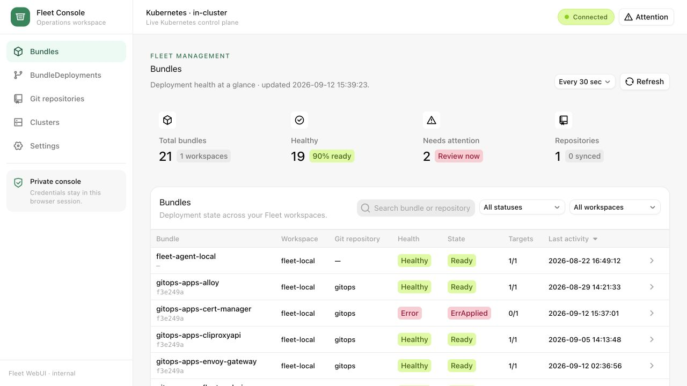
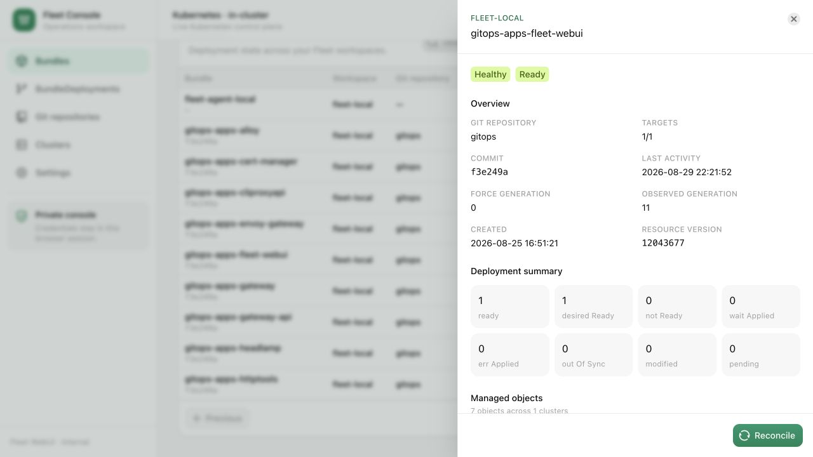

# Fleet WebUI

An independent web console for [Rancher Fleet](https://github.com/rancher/fleet), built with Go and React.

## Features

- Browse Bundles, GitRepos, Clusters and BundleDeployments.
- Inspect Desired/Live YAML, diffs, events and container logs.
- Reconcile Bundles, sync GitRepos, and pin or resume revisions.
- View Git history, including private repositories.
- Receive ntfy and browser notifications.

## Screenshots





## Run locally

Requires Go 1.27+, Node.js 22.12+, npm and a kubeconfig for a cluster running Fleet.

```sh
LISTEN_ADDR=127.0.0.1:8080 \
RECONCILE_ENABLED=false GIT_REPO_ACTIONS_ENABLED=false make run
```

Open [localhost:8080](http://localhost:8080). This starts in read-only mode using `$KUBECONFIG` or `~/.kube/config`.

To choose another file or context, set `FLEET_KUBECONFIG` and `FLEET_KUBECONTEXT`. See the [configuration guide](docs/CONFIGURATION.md) for other connection options and feature switches.

## Deploy

Use the [Helm chart](charts/fleet-webui/README.md) or the [read-only Kubernetes manifest](deploy/rbac.yaml). Container images and chart installation instructions are covered in the [release guide](docs/RELEASING.md).

Fleet WebUI shares one server-side identity across visitors and has no built-in login. Deploy behind authenticated private access; see [Security](SECURITY.md).

## Development

The Go module, source and tests live in `server/`; the React source lives in `frontend/`. Frontend builds write to `server/dist/`, which is embedded in the Go binary. Run the following commands from the repository root:

```sh
make build  # Build a standalone binary
make test   # Build the frontend, run Go tests and go vet
make image  # Build a local linux/amd64 container image
```

For frontend development, start the Go server and run `npm --prefix frontend run dev` in another terminal.

After building the frontend, Go commands can also run directly in `server/`, for example `go -C server test ./...` from the repository root.

[Contributing](CONTRIBUTING.md) · [Releases](https://github.com/yxwuxuanl/fleet-webui/releases) · [Changelog](CHANGELOG.md) · [MIT license](LICENSE) · [Third-party notices](THIRD_PARTY_NOTICES.md)
